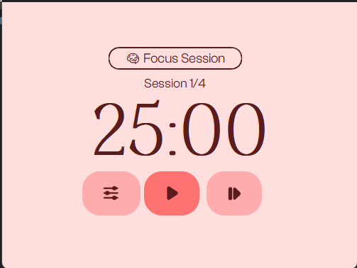
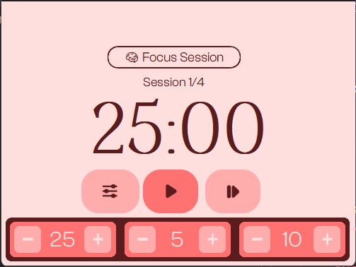

# Pomodoro Timer

A simple Pomodoro timer built with Python, using **CustomTkinter** for the GUI and other libraries like **pygame** for the audio.  

This project includes custom fonts, images, and a ringtone, packaged to work as a standalone Python project.

---

## Design Inspiration
I've been inspired by the design from the "Pomo" app for Desktop and Mobile


---

## Features

- Start, Pause, and Skip Pomodoro sessions  
- Custom button icons and fonts  
- Ringtone notification when a session ends  
- Clean GUI using CustomTkinter

---

## How to Use


- Button on the Left to Open the Options Menu
- Button on the Middle to Start/Stop Timer
- Button on the Right to Skip the Session
**In the Options Menu**
- Left Side Option for the Focus Session
- Middle Option for the Short Break
- Right Side Option for the Long Break

---

## Requirements

Make sure you have **Python 3.7+** installed. Then install the required libraries:

```bash
pip install customtkinter pygame pillow pyglet
